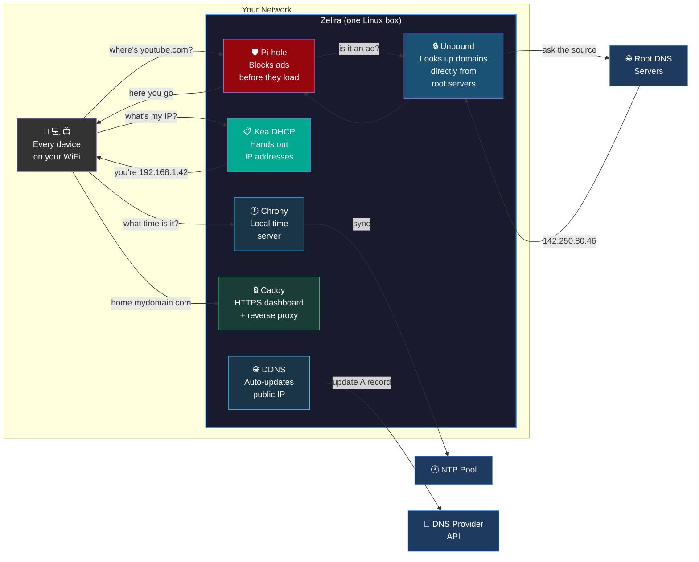
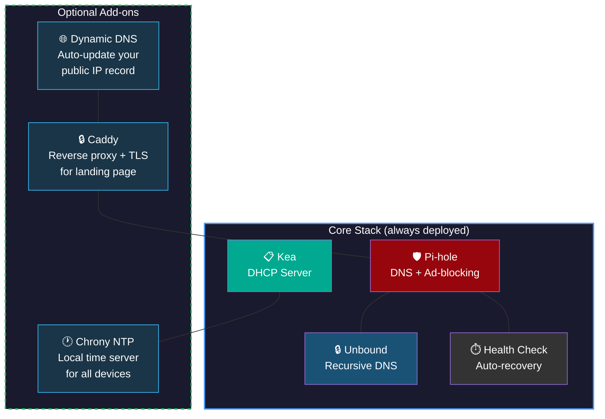
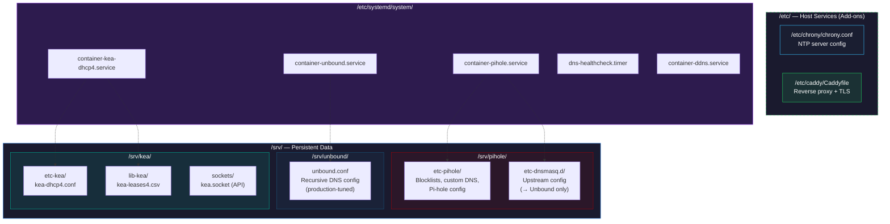
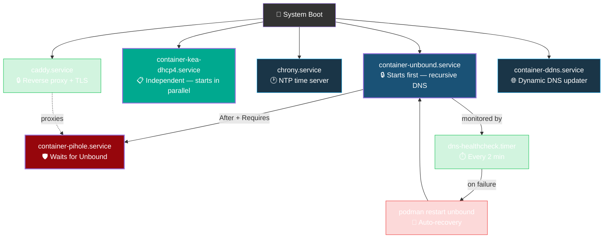
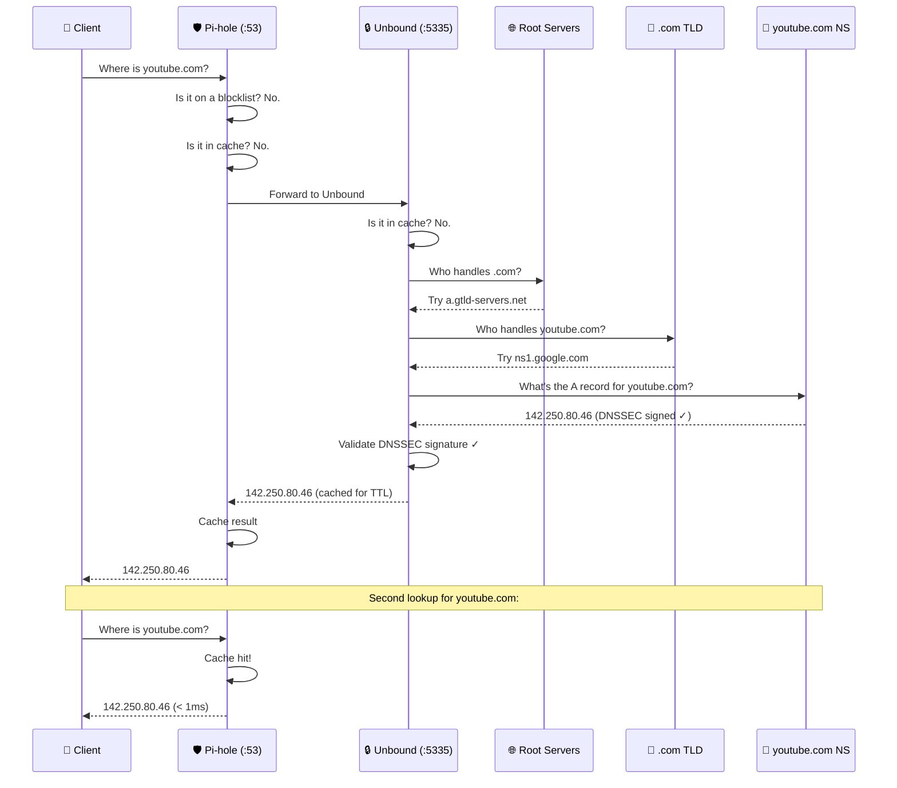
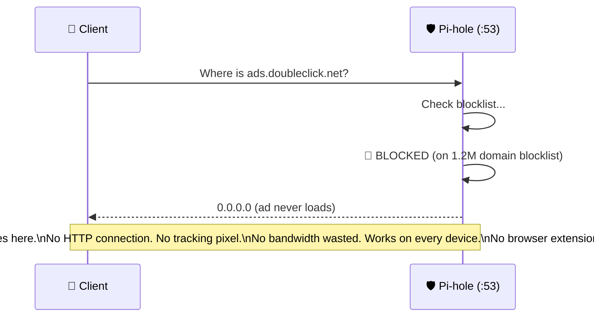
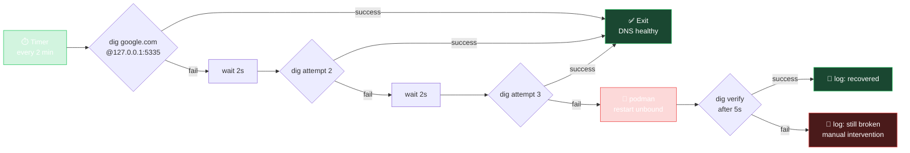

<p align="center">
  <h1 align="center">Zelira</h1>
  <p align="center">
    Containerized DNS + DHCP for homelabs.<br/>
    Pi-hole · Unbound · Kea — zero dependencies, one command.
  </p>
</p>

<p align="center">
  <a href="LICENSE.md"></a>
  
  
  
  
  
  
  
  
  
</p>

---

## The Big Picture

Every device on your home network needs two things to get online: an **IP address** (so it has an identity on the network) and **DNS** (so it can turn `google.com` into an actual server address). Normally, your ISP's router handles both — poorly. It hands out IPs, and forwards your DNS lookups to your ISP's servers, which are slow, log everything, and serve you ads.

Zelira replaces all of that with your own hardware — and adds time sync, dynamic DNS, and a dashboard on top:



**In plain terms:**
- **Kea** gives every device on your network an IP address (replaces your router's DHCP)
- **Pi-hole** blocks ads and trackers at the DNS level — before they even start loading — for every device on your network, no browser extensions needed
- **Unbound** resolves domain names by talking directly to the internet's root DNS servers instead of trusting Google or Cloudflare with your browsing history
- **Chrony** serves accurate time to every device on your LAN — critical for DNSSEC, TLS, and log correlation
- **Caddy** provides an HTTPS reverse proxy and dashboard at `https://home.yourdomain.com`
- **Dynamic DNS** auto-updates your public DNS record when your ISP changes your IP

The core three (Pi-hole, Unbound, Kea) run as containers on a single Linux box (a Raspberry Pi works great). The add-ons are optional but recommended. If the power goes out, Zelira heals itself automatically when it comes back.

### Optional Add-ons

The core stack is DNS + DHCP. But a proper network box should also handle time, dynamic DNS, and a landing page. Zelira includes add-on guides for all three:



| Add-on | What It Does | Guide |
|--------|-------------|-------|
| **NTP (Chrony)** | Local time server — all devices on your network sync clocks from this box instead of the internet | [docs/addon-ntp.md](docs/addon-ntp.md) |
| **Dynamic DNS** | Auto-updates your public DNS record when your ISP changes your IP (Namecheap, Cloudflare, DuckDNS) | [docs/addon-ddns.md](docs/addon-ddns.md) |
| **Landing Page (Caddy)** | HTTPS reverse proxy + dashboard — access Pi-hole and a status page at `https://home.yourdomain.com` | [docs/addon-dashboard.md](docs/addon-dashboard.md) |

---

## Why This Exists

Most "Pi-hole + Unbound" guides stop at `docker-compose up` and call it done. Then your power goes out, Unbound enters a SERVFAIL death spiral, Pi-hole's TCP connections to Unbound silently break, and your entire household loses DNS at 2 AM.

Zelira is the result of running this stack in production on a real home network — 40+ clients, 7 APs, managed switches, NVR cameras, IoT devices — and fixing every failure mode that appeared over months of operation. Every config value has a reason. Every auto-recovery mechanism exists because something actually broke.

**This is not a tutorial project.** It's a production-hardened deployment kit.

### What You Get

```
DNS query (:53) → Pi-hole (ad-blocking) → Unbound (:5335, recursive, DNSSEC) → Root servers
DHCP request (:67) → Kea DHCPv4 → IP + DNS pointer to Pi-hole
```

Three Podman containers. Three systemd services. One health check timer. No orchestrator. No YAML framework. Runs on a Raspberry Pi 5 or any Linux box with a static IP.

### Design Decisions

| Decision | Why |
|----------|-----|
| **Podman, not Docker** | Rootless containers, no daemon, native systemd integration, `podman generate systemd` |
| **systemd services, not Compose** | Compose is a convenience layer that adds a failure point. systemd is already there, handles restart policies natively, and survives reboots without a daemon |
| **`--network host`** | DNS and DHCP require raw socket access and must bind to real interfaces. Bridge/NAT networking breaks DHCP relay and adds latency to DNS |
| **Unbound, not Cloudflare/Quad9** | Zero third-party DNS dependency. Your DNS queries never leave your network until they hit root servers. Full DNSSEC validation |
| **Kea, not ISC DHCP** | ISC DHCP (dhcpd) is end-of-life. Kea is the official replacement — JSON config, REST API, modern lease management |
| **Memfile leases, not database** | A CSV file is simpler, doesn't require PostgreSQL, and survives container rebuilds. Good enough for <1000 clients |
| **`serve-expired: yes`** | During upstream outages, Unbound returns stale cached records instead of SERVFAIL. Your browser gets a slightly-old IP instantly instead of a 30-second timeout |

---

## Quick Start

```bash
git clone https://github.com/ParkWardRR/zelira.git && cd zelira

# 1. Configure your network
cp config/env.example config/.env
vi config/.env

# 2. Deploy everything
sudo ./deploy.sh

# 3. Verify
./scripts/health-check.sh
```

Then either:
- Point your router's DHCP to hand out this host's IP as the DNS server, **or**
- Disable your router's DHCP entirely and let Kea handle it

---

## Requirements

| Dependency | Version | Install | Why |
|-----------|---------|---------|-----|
| Linux | Debian 12+, Ubuntu 22.04+, Fedora 38+ | — | Host OS |
| Podman | 4.0+ | `apt install podman` | Container runtime |
| dig | any | `apt install dnsutils` | Health checks |
| envsubst | any | `apt install gettext-base` | Kea config templating |
| Static IP | — | Configure before deploying | This box IS your DNS/DHCP server |

### Tested Platforms

| Platform | CPU | RAM | Status |
|----------|-----|-----|--------|
| Raspberry Pi 5 | BCM2712 (arm64) | 8 GB | ✅ Primary target |
| Raspberry Pi 4 | BCM2711 (arm64) | 4 GB | ✅ Works (4 GB minimum) |
| Intel NUC | x86_64 | 8 GB | ✅ Works |
| Proxmox VM | x86_64 | 2 GB+ | ✅ Works |
| Any Debian/Ubuntu box | arm64 or amd64 | 2 GB+ | ✅ Should work |

---

## Architecture

```
zelira/
├── config/
│   ├── env.example              # ← copy to .env and edit
│   ├── unbound.conf             # recursive DNS (production-tuned)
│   └── kea-dhcp4.conf.template  # DHCP (templated from .env)
├── systemd/
│   ├── dns-healthcheck.service  # auto-recovery oneshot
│   └── dns-healthcheck.timer    # runs every 2 min
├── scripts/
│   ├── deploy.sh                # one-shot installer
│   ├── health-check.sh          # validate everything
│   ├── dns-healthcheck.sh       # Unbound auto-restart on failure
│   └── uninstall.sh             # clean removal
├── testing/
│   └── README.md                # test environment setup + firewall safety
├── docs/
│   ├── troubleshooting.md       # common issues + debug chain
│   ├── advanced.md              # DHCP reservations, monitoring, backup
│   ├── addon-ntp.md             # add-on: Chrony NTP time server
│   ├── addon-ddns.md            # add-on: Dynamic DNS updater
│   └── addon-dashboard.md       # add-on: Caddy reverse proxy + landing page
├── LICENSE.md                   # Blue Oak Model License 1.0.0
└── README.md
```

### Where Everything Lives on Disk



### Service Dependency Chain



### What Happens to a DNS Query

This is what happens when any device on your network types `youtube.com` into a browser:



### What Happens to an Ad Request



---

## Configuration

All settings in `config/.env`:

```bash
# ─── Network ───────────────────────────────────────────
ZELIRA_IP=192.168.1.2            # This host's static IP
ZELIRA_GATEWAY=192.168.1.1       # Your router
ZELIRA_SUBNET=192.168.1.0/24     # LAN subnet (CIDR)
ZELIRA_POOL_START=192.168.1.100  # DHCP pool start
ZELIRA_POOL_END=192.168.1.250    # DHCP pool end
ZELIRA_DOMAIN=home.local         # Local domain name
ZELIRA_INTERFACE=eth0            # NIC Kea listens on

# ─── General ───────────────────────────────────────────
ZELIRA_TZ=America/New_York       # Container timezone
ZELIRA_PIHOLE_PASSWORD=changeme  # Pi-hole web UI password
```

### Common Subnet Examples

| Network | ZELIRA_SUBNET | ZELIRA_GATEWAY | ZELIRA_IP |
|---------|---------------|----------------|-----------|
| Typical home | `192.168.1.0/24` | `192.168.1.1` | `192.168.1.2` |
| Larger home | `192.168.0.0/16` | `192.168.0.1` | `192.168.0.2` |
| 10.x network | `10.0.0.0/24` | `10.0.0.1` | `10.0.0.2` |
| 172.16 lab | `172.16.0.0/16` | `172.16.1.1` | `172.16.1.69` |

---

## Stack Details

### Pi-hole — DNS Ad-Blocker

| | |
|---|---|
| Image | `docker.io/pihole/pihole:latest` |
| Network | host mode (`:53`, `:80`) |
| Web UI | `http://<IP>/admin` |
| Upstream | Unbound at `127.0.0.1#5335` |
| Data | `/srv/pihole/etc-pihole/`, `/srv/pihole/etc-dnsmasq.d/` |

The deploy script creates `/srv/pihole/etc-dnsmasq.d/99-zelira-upstream.conf` which forces Pi-hole to use only local Unbound. No queries go to Google, Cloudflare, or any external resolver.

### Unbound — Recursive DNS Resolver

| | |
|---|---|
| Image | `docker.io/klutchell/unbound:latest` |
| Network | host mode (`127.0.0.1:5335`) |
| Upstream | Root DNS servers directly |
| DNSSEC | Full validation enabled |
| Data | `/srv/unbound/unbound.conf` |

**Key tuning (all based on production incidents):**

| Setting | Value | Why |
|---------|-------|-----|
| `tcp-idle-timeout` | `120000` (2 min) | Pi-hole FTL pools TCP connections. Default 10s causes 100+ errors/hr. See [Pitfall #1](#1-unbound-tcp-idle-timeout--pihole-ftl-connection-storms) |
| `incoming-num-tcp` | `20` | Default 10 is too low for Pi-hole's connection pooling |
| `serve-expired` | `yes` | Returns stale cache during outages instead of SERVFAIL |
| `serve-expired-ttl` | `86400` | Serve stale records up to 24h old |
| `infra-host-ttl` | `60` | Forget "host down" in 60s, not default 900s. See [Pitfall #2](#2-unbound-servfail-death-spiral-after-power-outage) |
| `prefetch` | `yes` | Refresh popular records before TTL expires |
| `edns-buffer-size` | `1232` | Prevents fragmentation issues with DNSSEC responses |

### Kea DHCPv4 — DHCP Server

| | |
|---|---|
| Image | `docker.io/jonasal/kea-dhcp4:2.6` |
| Network | host mode (`:67`) |
| Config | `/srv/kea/etc-kea/kea-dhcp4.conf` |
| Leases | `/srv/kea/lib-kea/kea-leases4.csv` |
| Control socket | `/srv/kea/sockets/kea.socket` |

Kea is the ISC's modern replacement for the legacy `dhcpd`. JSON config, unix socket API, memfile lease storage. The config template is populated from your `.env` at deploy time via `envsubst`.

### Chrony — NTP Time Server *(add-on)*

| | |
|---|---|
| Type | Host service (not containerized) |
| Port | `123/UDP` |
| Config | `/etc/chrony/chrony.conf` |
| Upstream | `pool.ntp.org` (stratum 2-3) |
| Guide | [docs/addon-ntp.md](docs/addon-ntp.md) |

Serves accurate time to every device on your LAN. Critical for DNSSEC validation, TLS certificate checks, and log correlation. Kea can advertise this server via DHCP Option 42.

### Dynamic DNS — DDNS Updater *(add-on)*

| | |
|---|---|
| Image | `docker.io/linuxshots/namecheap-ddns` (or Cloudflare/DuckDNS) |
| Network | host mode (outbound HTTPS only) |
| Config | Env vars in `config/.env` |
| Guide | [docs/addon-ddns.md](docs/addon-ddns.md) |

Auto-updates a public DNS A record when your ISP changes your IP. No inbound ports required — makes a single HTTPS call every 5 minutes.

### Caddy — Reverse Proxy & Dashboard *(add-on)*

| | |
|---|---|
| Type | Host service (not containerized) |
| Ports | `443/TCP` (HTTPS), `80/TCP` (redirect) |
| Config | `/etc/caddy/Caddyfile` |
| Guide | [docs/addon-dashboard.md](docs/addon-dashboard.md) |

Provides auto-TLS HTTPS for Pi-hole's web UI and an optional dashboard at `https://home.yourdomain.com`. Handles certificate renewal automatically — no certbot or cron needed.

---

## Auto-Recovery



This exists because Unbound can enter a SERVFAIL death spiral after upstream connectivity is restored (see [Pitfall #2](#2-unbound-servfail-death-spiral-after-power-outage)). The timer catches this automatically.

```bash
# Check auto-recovery history
journalctl -t dns-healthcheck --since "24 hours ago"
```

---

## Health Check

```bash
./scripts/health-check.sh
```

Output:

```
Zelira Health Check
═══════════════════

Containers:
  ✓ unbound (Up 7 weeks)
  ✓ pihole (Up 33 hours)
  ✓ kea-dhcp4 (Up 33 hours)

Systemd:
  ✓ container-unbound
  ✓ container-pihole
  ✓ container-kea-dhcp4
  ✓ dns-healthcheck.timer

DNS:
  ✓ Unbound (127.0.0.1:5335) → 142.251.218.14
  ✓ Pi-hole (127.0.0.1:53) → 142.251.218.14
  ✓ DNSSEC validation working
  ✓ Ad-blocking active (ads.google.com → blocked)

Ports:
  ✓ Port 53 (DNS)
  ✓ Port 80 (Pi-hole Web)
  ✓ Port 5335 (Unbound)
  ✓ Port 67 (DHCP)

═══════════════════
Results: 12 passed, 0 failed, 0 warnings
Status: HEALTHY
```

---

## Lessons Learned & Pitfalls

> These are real production incidents from running this stack on a 40+ client home network. Every fix is baked into Zelira's default configs so you never hit these.

### #1: Unbound TCP Idle Timeout → Pi-hole FTL Connection Storms

**What happened:** Pi-hole's FTL engine pools TCP connections to Unbound for performance. Unbound's default `tcp-idle-timeout` is `10000` ms (10 seconds). When Pi-hole's connection sits idle for more than 10 seconds, Unbound closes it. Pi-hole's next query on that dead connection fails, logs a warning, and falls back to UDP. DNS still resolves, but every reconnection causes a latency spike.

**How bad was it:** 105 TCP error warnings per hour. Every 30-40 seconds:
```
WARNING: Connection error (127.0.0.1#5335): TCP connection failed while 
receiving payload length from upstream (Connection prematurely closed by 
remote server)
```

**The fix:** `tcp-idle-timeout: 120000` (2 minutes). Also `incoming-num-tcp: 20` and `outgoing-num-tcp: 20` to handle Pi-hole's connection pool size.

**Result:** 105 errors/hour → 0.

### #2: Unbound SERVFAIL Death Spiral After Power Outage

**What happened:** After a power outage restored connectivity, Unbound returned `SERVFAIL` for every query. The entire network lost DNS. Restarting Pi-hole didn't help — the problem was Unbound.

**Root cause:** Unbound's `infra-host-ttl` defaults to `900` seconds (15 minutes). When upstream servers were unreachable during the outage, Unbound marked all root servers as "down" in its infrastructure cache. When power came back, Unbound **refused to retry** for 15 minutes because it "remembered" the servers were down.

**The fix:** Two changes:
1. `infra-host-ttl: 60` — forget "host down" status after 60 seconds, not 15 minutes
2. `serve-expired: yes` with `serve-expired-ttl: 86400` — return stale cached records during outages instead of SERVFAIL

Plus the `dns-healthcheck.timer` as a safety net — if Unbound is still broken after 3 consecutive failures (6 minutes), auto-restart the container.

### #3: Pi-hole v6 Dual DNS Source Gotcha

**What happened:** After migrating a device's IP via DHCP, the device became unreachable by hostname even though `dig` returned the correct IP from Pi-hole.

**Root cause:** Pi-hole v6 stores local DNS records in **two places**:
1. `custom.list` — legacy flat file at `/srv/pihole/etc-pihole/custom.list`
2. `pihole.toml` — Pi-hole v6 config under `[dns] hosts = [...]`

The TOML takes priority. If a hostname exists in both files with different IPs, the TOML wins silently.

**The fix:** When adding or changing local DNS records, always update **both** files. Or use the Pi-hole web UI exclusively (it handles both). After any change: `sudo podman restart pihole`.

### #4: Kea DHCP Blocked by Switch DHCP Snooping

**What happened:** After deploying Kea, wireless clients stopped getting DHCP leases. Kea was running, sending `DHCPOFFER` packets, but they never reached the clients.

**Root cause:** A managed PoE switch upstream had DHCP Snooping enabled on all ports by default. DHCP Snooping drops `DHCPOFFER` packets from "untrusted" ports — and since the switch didn't know about Kea, it dropped every offer.

**The fix:** Either:
- Mark the port connected to the Zelira host as a "trusted" DHCP port on your managed switch
- Or disable DHCP Snooping entirely (acceptable for home networks)

This is especially common with EnGenius and Cisco managed switches. Unmanaged switches don't have this problem.

### #5: Kea Control Socket Permissions

**What happened:** After deploying a Kea metrics exporter (for Prometheus/Grafana), the exporter entered a crash loop — couldn't connect to Kea's control socket.

**Root cause:** The Kea container creates the unix socket at `/kea/sockets/kea.socket` with restrictive permissions. The exporter running on the host couldn't read it.

**The fix:** After Kea starts, set socket permissions:
```bash
chmod 666 /srv/kea/sockets/kea.socket
```

Or run the exporter inside the Kea container's network namespace.

### #6: Port 53 Already in Use (systemd-resolved)

**What happened:** Pi-hole failed to start because port 53 was already bound.

**Root cause:** `systemd-resolved` runs a stub DNS listener on `127.0.0.53:53` by default on Ubuntu/Debian. Pi-hole can't bind to `:53` while resolved is running.

**The fix:**
```bash
sudo systemctl disable --now systemd-resolved
sudo rm /etc/resolv.conf
echo "nameserver 127.0.0.1" | sudo tee /etc/resolv.conf
```

Or, if you want to keep resolved for the host only:
```bash
# /etc/systemd/resolved.conf
[Resolve]
DNSStubListener=no
```

### #7: Container Image Pulls Failing on arm64

**What happened:** `podman pull` for the Unbound image failed with architecture mismatch errors on Raspberry Pi.

**Root cause:** Some container registries don't serve arm64 manifests correctly. The `klutchell/unbound` image supports multi-arch but older Podman versions sometimes pulled the wrong architecture.

**The fix:** Upgrade Podman to 4.0+ and explicitly specify the platform if needed:
```bash
podman pull --platform linux/arm64 docker.io/klutchell/unbound:latest
```

### #8: DHCP and DNS Must Start in the Right Order

**What happened:** After a reboot, clients got DHCP leases from Kea but couldn't resolve DNS. Pi-hole was up, but Unbound hadn't finished starting yet, so Pi-hole's first connection to `127.0.0.1#5335` failed and it cached the failure.

**The fix:** Zelira's systemd services enforce ordering:
```ini
# container-pihole.service
After=container-unbound.service
Requires=container-unbound.service
```

And `deploy.sh` adds a 3-second sleep between starting Unbound and Pi-hole to let Unbound fully initialize.

---

## Updating

```bash
sudo podman pull docker.io/pihole/pihole:latest
sudo podman pull docker.io/klutchell/unbound:latest
sudo podman pull docker.io/jonasal/kea-dhcp4:2.6

# Restart in dependency order
sudo systemctl restart container-unbound
sleep 3
sudo systemctl restart container-pihole container-kea-dhcp4

# Verify
./scripts/health-check.sh
```

Always restart Unbound first, wait, then restart Pi-hole. Restarting them simultaneously causes Pi-hole to fail its initial Unbound connection.

---

## Uninstalling

```bash
sudo ./scripts/uninstall.sh
```

Stops containers, removes systemd services and the health check script. **Config data in `/srv/` is preserved** for re-deployment.

Full purge: `sudo rm -rf /srv/pihole /srv/unbound /srv/kea`

---

## FAQ

**Q: Can I run this without DHCP (DNS only)?**
Yes. Don't start Kea: `sudo systemctl disable --now container-kea-dhcp4`. Point your router's DHCP to hand out this host's IP as the DNS server.

**Q: Can I run this on Docker instead of Podman?**
Yes, but you'll need to adapt the systemd service files. Replace `podman` with `docker` in the `ExecStart` lines. The container images are the same.

**Q: What happens during an internet outage?**
Unbound's `serve-expired` returns stale cached records. Clients get slightly-old DNS responses instantly instead of timeouts. Local DNS records (Pi-hole) are unaffected. DHCP continues to work — it's local-only.

**Q: How much RAM does this use?**
- Pi-hole: ~120 MB
- Unbound: ~40 MB
- Kea: ~20 MB
- Total: **~180 MB** (a 2 GB host is plenty)

**Q: Will this slow down my internet?**
No. Recursive DNS adds ~20-50ms on the **first** lookup of a domain (cache miss). After that, Pi-hole's cache returns results in <1ms. Compared to upstream resolvers like Cloudflare (1.1.1.1), the cache-hit performance is identical or better, and you get ad-blocking + DNSSEC + privacy (no query logging by third parties).

**Q: Can I add local DNS records?**
Yes. Use Pi-hole's web UI (Local DNS → DNS Records), or create `/srv/pihole/etc-dnsmasq.d/05-local-dns.conf`:
```
address=/nas.home.local/192.168.1.10
address=/printer.home.local/192.168.1.20
```

**Q: How do I add static DHCP reservations?**
Edit `/srv/kea/etc-kea/kea-dhcp4.conf` and add entries to the `reservations` array. See [docs/advanced.md](docs/advanced.md).

---

## Further Reading

- [Roadmap](docs/ROADMAP.md) — project history, current validation status, forward-looking plans
- [Troubleshooting](docs/troubleshooting.md) — common issues, debug chain, log commands
- [Advanced Configuration](docs/advanced.md) — DHCP reservations, monitoring, backup, DNS-only mode, security hardening
- [Add-on: NTP Time Server](docs/addon-ntp.md) — Chrony setup, DHCP Option 42, Prometheus metrics
- [Add-on: Dynamic DNS](docs/addon-ddns.md) — Namecheap, Cloudflare, DuckDNS auto-updaters
- [Add-on: Landing Page & Reverse Proxy](docs/addon-dashboard.md) — Caddy, auto-TLS, dashboard options

---

## License

[Blue Oak Model License 1.0.0](LICENSE.md) — a modern, [permissive](https://blueoakcouncil.org/license/1.0.0) open-source license written in plain English.
