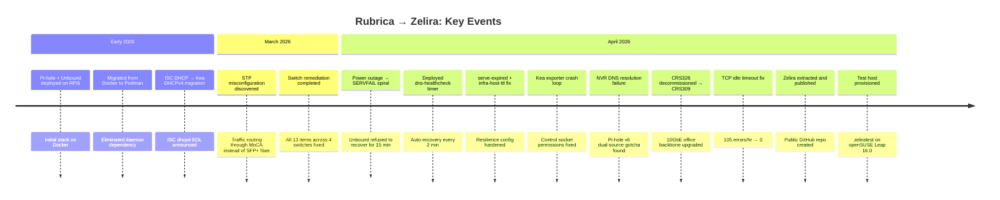
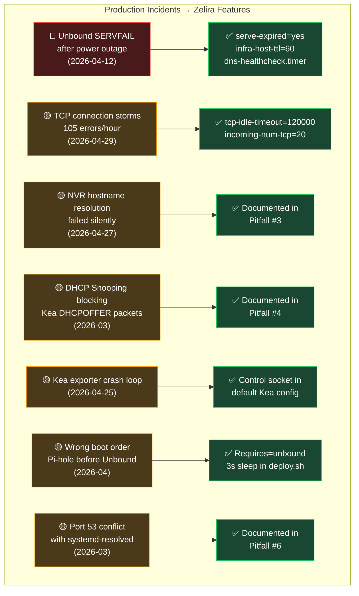

# Zelira — Roadmap

> History, current state, and where this project is headed.

---

## Origin Story

Zelira was extracted from a production home network called **Alpina** — a 40+ client deployment spanning 7 EnGenius WiFi 6 APs, a MikroTik CRS309 10GbE backbone, managed MikroTik and EnGenius switches, an NVR with 5 Reolink camera streams, a Proxmox hypervisor cluster, IoT devices, and multiple NAS units. The DNS/DHCP stack ran on a Raspberry Pi 5 node called **Rubrica** — the single most critical piece of infrastructure on the network.

When Rubrica goes down, everything goes down. No DHCP means new devices can't join the network. No DNS means nothing can resolve. No Unbound means even cached queries eventually expire and die. The stack needed to be bulletproof.

Every config value, every auto-recovery mechanism, and every pitfall documented in this repo exists because something actually broke on that network — usually at 2 AM, usually after a power outage, and usually discovered because someone yelled "the internet is down" from three rooms away.

The decision to extract Rubrica's stack into a standalone public project came from realizing that every "Pi-hole + Unbound" guide on the internet stops at `docker-compose up` and never addresses:
- What happens when the power goes out and Unbound's infra cache poisons itself
- What happens when Pi-hole's FTL engine silently drops 105 TCP connections per hour to Unbound
- What happens when you migrate a device's IP in DHCP and Pi-hole v6 has two conflicting DNS record sources
- What happens when your managed switch silently drops all DHCPOFFER packets because of DHCP Snooping
- What happens when the containers restart in the wrong order after a reboot

---

## Production Timeline

> Real dates from the Alpina network operations log. This is the history that shaped Zelira.

### Phase 0 — Production Hardening (pre-release)

*Running on the Alpina network for months before Zelira existed as a project.*

| Date | Event | Impact |
|------|-------|--------|
| Early 2026 | Pi-hole + Unbound deployed on Rubrica (Raspberry Pi 5, Debian arm64, 8 GB RAM) | Core DNS operational |
| Early 2026 | Migrated from Docker + Compose to Podman + systemd | Eliminated Docker daemon as single point of failure; `podman generate systemd` for native service management |
| Early 2026 | Migrated from ISC DHCP (`dhcpd`) to Kea DHCPv4 2.6 | ISC DHCP end-of-life; Kea provides JSON config, REST API, memfile leases |
| 2026-03-xx | Hit DHCP Snooping issue on EnGenius ECS2512FP | Kea `DHCPOFFER` packets silently dropped by managed switch; fix: mark port as trusted |
| 2026-04-10 | STP path cost remediation across all switches | Traffic was routing through MoCA (ether11, cost=10) instead of SFP+ fiber; fixed by setting SFP+ cost=2000, MoCA cost=20000 |
| 2026-04-10 | Full switch audit — 13 remediation items completed | Renamed switches, fixed STP priorities, mapped all 7 AP ports via LLDP, removed redundant MoCA path |
| 2026-04-12 | **Incident: Unbound SERVFAIL death spiral** after power outage | `infra-host-ttl` default (900s) caused Unbound to remember root servers as "down" for 15 minutes after power restored |
| 2026-04-12 | Deployed `dns-healthcheck.timer` | Auto-restarts Unbound after 3 consecutive DNS failures (every 2 minutes) |
| 2026-04-12 | Added `serve-expired` + `infra-host-ttl: 60` | Stale cache returned during outages; "host down" forgotten after 60s instead of 15min |
| 2026-04-17 | Podman systemd service files regenerated | Updated to Podman 5.4.2 format with `--cidfile`, `--sdnotify=conmon`, `--replace` |
| 2026-04-19 | Added Caddy with Namecheap DNS-01 challenge | Local HTTPS for `home.alpina.casa` and `rubrica.alpina.casa` |
| 2026-04-19 | Added Dynamic DNS updater | Namecheap DDNS container updating public A record every 5 minutes |
| 2026-04-24 | Gateway SSH key auth deployed; syslog-ng migrated to static IPs | Security hardening on OPNsense |
| 2026-04-25 | **Fleet-wide remediation audit** — 12 hosts probed | Found: NVR disk at 90%, NVRHost RAM at 30/32 GB, Rubrica backup locks stale, Kea exporter crash loop (missing control socket), 5 hosts with pending kernel updates |
| 2026-04-25 | Fixed Kea exporter crash loop | Added `control-socket` to Kea config, `chmod 666` on socket, exporter now serving 12 `kea_dhcp4` metrics |
| 2026-04-25 | Fixed Rubrica backup (stale Restic lock) | `restic unlock` cleared 10h-old lock from PID 2847419 |
| 2026-04-27 | **Incident: NVR unreachable by hostname** | Pi-hole v6 `pihole.toml` had old bare-metal IP (`172.16.6.177`) while `custom.list` had correct DHCP-reserved IP (`172.16.3.4`). TOML won silently. |
| 2026-04-27 | Documented Pi-hole v6 dual DNS source gotcha | Both `custom.list` and `pihole.toml` `[dns] hosts` must be updated; TOML takes priority |
| 2026-04-29 | **Incident: TCP connection storms** — 105 errors/hour | Unbound `tcp-idle-timeout` default (10s) killed Pi-hole FTL's pooled TCP connections; fixed with `tcp-idle-timeout: 120000` + `incoming/outgoing-num-tcp: 20` |
| 2026-04-29 | WAN exposure audit on OPNsense | Confirmed SNMP probes against public IP (`24.24.162.10`) correctly dropped by default `pf` block rule; recommended binding lighttpd/sshd to LAN only |
| 2026-04-29 | CRS326-T-Office decommissioned | Replaced by CRS309 at `.55` for 10GbE office backbone; all docs updated across 8 files |
| 2026-04-29 | **Zelira extracted and published** | `github.com/ParkWardRR/zelira` — public repo with generalized configs, deploy script, health checks, and add-on docs |

### Phase 1 — Public Release *(current)*

*Extracted from Alpina, generalized, documented, and published.*

| Date | Commit | Milestone |
|------|--------|-----------|
| 2026-04-29 | `fbd6f98` | Initial release: core stack (Pi-hole, Unbound, Kea), deploy script, health check, uninstall |
| 2026-04-29 | `2eb4429` | Mermaid diagrams: DNS flow, ad-blocking, auto-recovery, file layout, boot chain |
| 2026-04-29 | `490b8c7` | Add-on documentation: NTP (Chrony), Dynamic DNS, Landing Page (Caddy) |
| 2026-04-29 | `6be7d5d` | Testing framework: isolated podman DHCP test, firewall safety docs, README expanded with full stack diagrams |

### Phase 2 — Validation *(in progress)*

| Status | Item | Notes |
|--------|------|-------|
| ✅ | Test host provisioned (`zeliratest`, openSUSE Leap 16.0, Podman 5.4.2) | Separate from production Rubrica |
| ✅ | Firewall safety: DHCP blocked on LAN via `firewalld` direct rules | Prevents test Kea from conflicting with production DHCP |
| ✅ | Isolated DHCP test: Kea hands out leases inside podman internal network | Verified Kea config templating + lease file creation |
| ⬜ | Full `deploy.sh` end-to-end run on test host | Need to run complete deploy on clean Debian 12 |
| ⬜ | DNS validation: Pi-hole → Unbound → root servers (DNSSEC verified) | Test full chain with `dig +dnssec` |
| ⬜ | Health check timer validation: simulate Unbound failure, confirm auto-recovery | `podman stop unbound` → wait for timer → verify restart |
| ⬜ | Boot ordering test: cold reboot, verify Unbound → Pi-hole → Kea sequence | Power cycle test host, check `systemctl` status |
| ⬜ | Add-on validation: Chrony NTP on test host | Install Chrony, verify `chronyc sources` + client access |

---

## Forward Roadmap

### Phase 3 — Hardening

| Priority | Item | Description |
|----------|------|-------------|
| 🔴 High | **`deploy.sh` idempotency** | Running `deploy.sh` twice should be safe — detect existing state, skip redundant work, don't overwrite user-modified configs |
| 🔴 High | **openSUSE compatibility** | Currently tested on Debian/Ubuntu. Validate and fix for zypper-based distros (Leap, Tumbleweed) — package names differ (`dnsutils` → `bind-utils`, etc.) |
| 🟡 Medium | **Config validation** | Pre-flight check in `deploy.sh` that validates `.env` values (valid IPs, CIDR math, interface exists, port conflicts) |
| 🟡 Medium | **`uninstall.sh` completeness** | Verify clean removal on all tested platforms |
| 🟡 Medium | **Kea config validation** | `envsubst` silently produces broken JSON if a var is missing — add JSON syntax check with `python3 -m json.tool` after templating |
| 🟡 Medium | **systemd-resolved detection** | `deploy.sh` should auto-detect and disable `systemd-resolved` on Ubuntu/Debian to prevent port 53 conflicts |

### Phase 4 — Add-on Integration

| Priority | Item | Description |
|----------|------|-------------|
| 🔴 High | **Add-on deploy scripts** | `deploy-ntp.sh`, `deploy-ddns.sh`, `deploy-dashboard.sh` — same one-command pattern as core |
| 🟡 Medium | **Unified `.env`** | Add-on config (NTP, DDNS, Caddy) in the same `.env` with optional sections |
| 🟡 Medium | **Health check expansion** | Include NTP sync status, DDNS update age, and Caddy cert expiry in `health-check.sh` |
| 🟡 Medium | **Kea Option 42 integration** | Auto-inject NTP server IP into Kea config if Chrony add-on is deployed |
| 🟢 Low | **Add-on: Prometheus metrics** | Export Pi-hole, Unbound, Kea, and Chrony metrics for Grafana dashboards |
| 🟢 Low | **Add-on: ISC Stork** | Kea management web UI for viewing leases, reservations, and stats |

### Phase 5 — Multi-Platform

| Priority | Item | Description |
|----------|------|-------------|
| 🟡 Medium | **Fedora/RHEL support** | Test and document on Fedora 40+, AlmaLinux 9 |
| 🟡 Medium | **Docker fallback** | Optional Docker-compatible mode for users who don't have Podman |
| 🟢 Low | **NixOS module** | Declarative deployment via NixOS configuration |
| 🟢 Low | **Ansible playbook** | For users who prefer config management over shell scripts |

### Phase 6 — Community

| Priority | Item | Description |
|----------|------|-------------|
| 🟡 Medium | **CI/CD** | GitHub Actions: lint configs, run isolated DHCP test, validate deploy script syntax, ShellCheck |
| 🟡 Medium | **Contributing guide** | `CONTRIBUTING.md` with issue templates, PR standards |
| 🟢 Low | **Example configs** | Pre-built `.env` examples for common setups (apartment, house, homelab with VLANs) |
| 🟢 Low | **Migration guide** | Step-by-step from existing Pi-hole Docker Compose → Zelira |
| 🟢 Low | **Comparison page** | Zelira vs. docker-compose setups vs. Technitium vs. AdGuard Home |

---

## Incident Log

> Every production incident that shaped Zelira's design.

### Incident Details

| # | Date | Severity | Incident | Root Cause | Resolution | Zelira Feature |
|---|------|----------|----------|------------|------------|----------------|
| 1 | 2026-04-12 | 🔴 Critical | Unbound SERVFAIL death spiral after power outage | `infra-host-ttl` default 900s — Unbound remembered root servers as "down" for 15 min | `infra-host-ttl: 60`, `serve-expired: yes`, `dns-healthcheck.timer` | Default in `unbound.conf` + auto-recovery timer |
| 2 | 2026-04-29 | 🟡 High | Pi-hole FTL TCP connection storms — 105 errors/hour | Unbound `tcp-idle-timeout` default 10s kills Pi-hole's pooled TCP connections | `tcp-idle-timeout: 120000`, `incoming/outgoing-num-tcp: 20` | Default in `unbound.conf` |
| 3 | 2026-04-27 | 🟡 High | NVR unreachable by hostname | Pi-hole v6 dual DNS source — `pihole.toml` overrode `custom.list` silently | Update both files; document in pitfalls | Pitfall #3 in README |
| 4 | 2026-03-xx | 🟡 High | Wireless clients not getting DHCP leases | EnGenius DHCP Snooping dropping DHCPOFFER from untrusted port | Mark Zelira's port as trusted, or disable snooping | Pitfall #4 in README |
| 5 | 2026-04-25 | 🟡 Medium | Kea metrics exporter crash loop | Control socket missing from Kea config; permissions too restrictive | Added `control-socket` to Kea template; documented `chmod 666` | Default in `kea-dhcp4.conf.template` |
| 6 | 2026-04-xx | 🟡 Medium | Pi-hole failed DNS after reboot | Unbound not ready when Pi-hole started; Pi-hole cached the failure | `Requires=container-unbound.service` + 3s sleep in deploy.sh | Default in systemd services |
| 7 | 2026-03-xx | 🟡 Medium | Port 53 conflict on Ubuntu | `systemd-resolved` stub listener bound to `:53` | Disable resolved or set `DNSStubListener=no` | Pitfall #6 in README |

---

## Non-Goals

Things Zelira will **not** do:

| Non-Goal | Why |
|----------|-----|
| **Web-based configuration UI** | The `.env` file is the single source of truth. A UI adds complexity and another failure point |
| **IPv6 DHCP (DHCPv6)** | Most homelabs are IPv4-only for DHCP. IPv6 RA/SLAAC works fine without a managed DHCPv6 server |
| **Multi-node clustering** | Zelira is a single-box deployment. If you need HA, run two instances with keepalived |
| **DNS-over-HTTPS (DoH) / DNS-over-TLS (DoT)** | Zelira resolves recursively — there's no upstream to encrypt to. DoH/DoT for clients is better handled at the router level |
| **Container orchestration** | No Kubernetes, no Compose, no Swarm. systemd is the orchestrator |
| **VPN integration** | WireGuard/Tailscale are out of scope. Zelira handles DNS/DHCP; VPN is a network-layer concern handled by your router or a dedicated node |

---

## Design Principles

These guide every decision:

1. **Every config value has a reason.** No defaults for the sake of defaults. If a value is set, there's a production incident behind it.
2. **One command to deploy, one command to verify.** `sudo ./deploy.sh` and `./scripts/health-check.sh`.
3. **No external dependencies at runtime.** DNS resolves from root servers. DHCP is local. NTP syncs to pool.ntp.org. Nothing phones home.
4. **Survive power outages gracefully.** Stale cache, auto-recovery timers, correct boot ordering, fast infra-cache TTL.
5. **Podman + systemd, not Docker + Compose.** Fewer moving parts, no daemon, native restart policies.
6. **Document the failures, not just the successes.** Every pitfall section exists because someone lost DNS at 2 AM.

---

## Network Scale Reference

The Alpina network that Zelira was extracted from, for context on scale:

| Component | Count/Details |
|-----------|---------------|
| WiFi APs | 7 × EnGenius EWS377AP (WiFi 6) |
| Managed switches | 3 × MikroTik (CRS309 core, CRS326 access, CRS309 office) + 1 × EnGenius ECS2512FP PoE |
| Backbone | 10GbE SFP+ DAC/fiber between all switches |
| DHCP clients | 40+ active leases, 25 static reservations |
| DNS queries | ~15,000–25,000/day through Pi-hole |
| Ad domains blocked | ~180,000 on default blocklists |
| Camera streams | 5 × Reolink (air-gapped VLAN via NVR) |
| Hypervisors | 2 × Proxmox (9 VMs + 1 NVR VM) |
| NAS | Synology DSM 7.x (77 TB across 3 volumes) |
| Gateway | OPNsense on FreeBSD 14.3 (Suricata IDS, ~200K rules) |
| Monitoring | Grafana + Prometheus + Loki + Alloy (24-month retention) |
