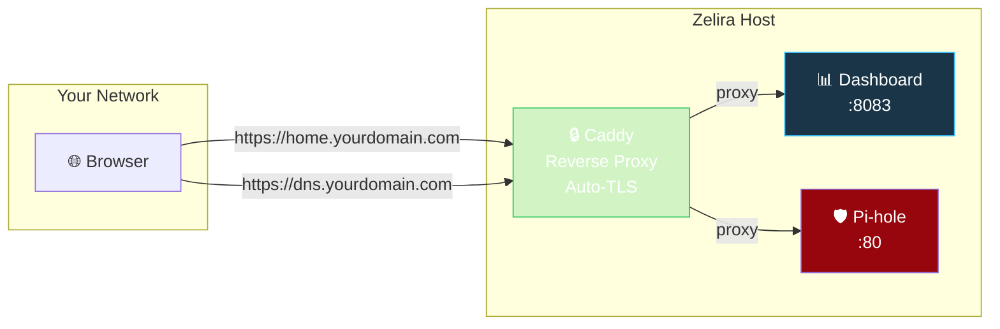

# Add-on: Landing Page & Reverse Proxy (Caddy)

Run a local dashboard/landing page on your Zelira host with automatic HTTPS via Caddy. Access your services at `https://home.yourdomain.com` from anywhere on your LAN.

## What This Gives You



Instead of remembering IP addresses, you get:
- `https://home.yourdomain.com` → your dashboard
- `https://dns.yourdomain.com` → Pi-hole admin UI
- Real HTTPS certificates (not self-signed), auto-renewed by Caddy

## Prerequisites

- A domain name you own (e.g., from Namecheap, Cloudflare, etc.)
- DNS records pointing to your Zelira host's LAN IP (or use the [DDNS add-on](addon-ddns.md))
- Port 443 accessible on the Zelira host (no other web server using it)

## Setup

### 1. Install Caddy

```bash
# Debian/Ubuntu
sudo apt install -y debian-keyring debian-archive-keyring apt-transport-https
curl -1sLf 'https://dl.cloudsmith.io/public/caddy/stable/gpg.key' | sudo gpg --dearmor -o /usr/share/keyrings/caddy-stable-archive-keyring.gpg
curl -1sLf 'https://dl.cloudsmith.io/public/caddy/stable/debian.deb.txt' | sudo tee /etc/apt/sources.list.d/caddy-stable.list
sudo apt update
sudo apt install caddy
```

If you need DNS-based TLS challenges (for LAN-only hosts not reachable from the internet), build Caddy with a DNS provider plugin:

```bash
# Example: Caddy with Namecheap DNS plugin
xcaddy build --with github.com/caddy-dns/namecheap
sudo mv caddy /usr/bin/caddy
```

### 2. Configure Caddyfile

```bash
sudo tee /etc/caddy/Caddyfile > /dev/null << 'EOF'
{
    persist_config off
}

# Dashboard / Landing Page
home.yourdomain.com {
    reverse_proxy 127.0.0.1:8083
    encode gzip
    header {
        X-Content-Type-Options "nosniff"
        X-Frame-Options "SAMEORIGIN"
        Referrer-Policy "strict-origin-when-cross-origin"
    }
}

# Pi-hole Admin (optional — gives it a real HTTPS URL)
dns.yourdomain.com {
    reverse_proxy 127.0.0.1:80
    encode gzip
    header {
        X-Content-Type-Options "nosniff"
        X-Frame-Options "SAMEORIGIN"
    }
}
EOF
```

> **Note:** If your Zelira host is only accessible from LAN (no port forwarding), use DNS challenge for TLS. Add your DNS provider's plugin and credentials. See [Caddy DNS challenge docs](https://caddyserver.com/docs/automatic-https#dns-challenge).

### 3. Start Caddy

```bash
sudo systemctl enable --now caddy
sudo systemctl status caddy
```

### 4. Verify

```bash
# Check Caddy is running and TLS is active
curl -I https://home.yourdomain.com
# Should return HTTP/2 200 with valid TLS
```

## Dashboard Options

You can serve any dashboard or static site on port 8083. Some options:

### Option A: Simple Status Page (built-in)

Create a minimal HTML page showing your stack status:

```bash
sudo mkdir -p /var/www/dashboard
sudo tee /var/www/dashboard/index.html > /dev/null << 'HTML'
<!DOCTYPE html>
<html>
<head>
    <title>Home Network</title>
    <style>
        body { font-family: system-ui; background: #0a0a0a; color: #e0e0e0; 
               display: flex; justify-content: center; padding: 2rem; }
        .card { background: #1a1a2e; border-radius: 12px; padding: 2rem; 
                max-width: 600px; width: 100%; }
        h1 { color: #4a9eff; margin-top: 0; }
        .service { display: flex; justify-content: space-between; 
                   padding: 0.75rem 0; border-bottom: 1px solid #333; }
        .status { color: #22c55e; }
        a { color: #4a9eff; text-decoration: none; }
    </style>
</head>
<body>
    <div class="card">
        <h1>🏠 Home Network</h1>
        <div class="service"><span>Pi-hole DNS</span><a href="/admin">Admin →</a></div>
        <div class="service"><span>Ad Blocking</span><span class="status">● Active</span></div>
        <div class="service"><span>DNSSEC</span><span class="status">● Validated</span></div>
        <div class="service"><span>DHCP Server</span><span class="status">● Running</span></div>
        <div class="service"><span>NTP Server</span><span class="status">● Synced</span></div>
    </div>
</body>
</html>
HTML
```

Then serve it with a simple static file server:
```bash
# Use Caddy's built-in file server instead of reverse_proxy
# In Caddyfile, replace:  reverse_proxy 127.0.0.1:8083
# With:                   root * /var/www/dashboard
#                         file_server
```

### Option B: Homer Dashboard

[Homer](https://github.com/bastienwirtz/homer) is a lightweight dashboard for homelab services:

```bash
sudo podman run -d \
    --name homer \
    --network host \
    -p 8083:8080 \
    -v /srv/homer:/www/assets:Z \
    docker.io/b4bz/homer:latest
```

### Option C: Your Own App

Run any web app on port 8083. Caddy will reverse-proxy and handle TLS automatically.

## Security Notes

- Caddy auto-renews TLS certificates. No cron jobs or certbot needed.
- The `X-Frame-Options` and `X-Content-Type-Options` headers prevent clickjacking and MIME sniffing.
- If using DNS challenge, store API credentials in environment variables (not in the Caddyfile directly).
