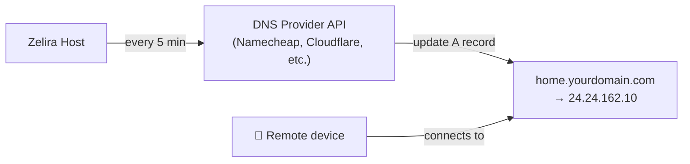

# Add-on: Dynamic DNS (DDNS)

Automatically updates a DNS record with your home's public IP address, so you can reach your network remotely at `home.yourdomain.com` even when your ISP changes your IP.

## How It Works



A lightweight container runs every N minutes, checks your public IP, and updates your DNS provider if it changed.

## Supported Providers

| Provider | Container Image | Env Vars |
|----------|----------------|----------|
| **Namecheap** | `linuxshots/namecheap-ddns` | `NC_HOST`, `NC_DOMAIN`, `NC_PASS`, `NC_INTERVAL` |
| **Cloudflare** | `oznu/cloudflare-ddns` | `API_KEY`, `ZONE`, `SUBDOMAIN` |
| **DuckDNS** | `lscr.io/linuxserver/duckdns` | `TOKEN`, `SUBDOMAINS` |
| **Any (ddclient)** | `lscr.io/linuxserver/ddclient` | Config file based |

## Setup (Namecheap Example)

### 1. Enable Dynamic DNS in Namecheap

1. Log into Namecheap → Domain List → your domain → Advanced DNS
2. Toggle **Dynamic DNS** to ON
3. Copy the **Dynamic DNS Password** (this is NOT your account password)
4. Add an **A + Dynamic DNS Record** for your subdomain (e.g., `home`)

### 2. Add to `.env`

Add these to your `config/.env`:

```bash
# ─── Dynamic DNS (optional) ───────────────────────────
ZELIRA_DDNS_PROVIDER=namecheap
ZELIRA_DDNS_HOST=home
ZELIRA_DDNS_DOMAIN=yourdomain.com
ZELIRA_DDNS_PASSWORD=your-ddns-password-here
ZELIRA_DDNS_INTERVAL=300   # seconds (5 minutes)
```

### 3. Deploy

```bash
# Create and start the DDNS service
sudo tee /etc/systemd/system/container-ddns.service > /dev/null << 'EOF'
[Unit]
Description=Zelira — Dynamic DNS Updater
Wants=network-online.target
After=network-online.target

[Service]
Restart=always
TimeoutStopSec=30
ExecStartPre=-/usr/bin/podman rm -f ddns
ExecStart=/usr/bin/podman run \
    --rm \
    --name ddns \
    --net host \
    -e NC_HOST=${ZELIRA_DDNS_HOST} \
    -e NC_DOMAIN=${ZELIRA_DDNS_DOMAIN} \
    -e NC_PASS=${ZELIRA_DDNS_PASSWORD} \
    -e NC_INTERVAL=${ZELIRA_DDNS_INTERVAL} \
    docker.io/linuxshots/namecheap-ddns
ExecStop=/usr/bin/podman stop -t 10 ddns
Type=simple

[Install]
WantedBy=multi-user.target
EOF

sudo systemctl daemon-reload
sudo systemctl enable --now container-ddns.service
```

### 4. Verify

```bash
# Check container is running
sudo podman logs ddns

# Verify your public IP matches the DNS record
dig +short home.yourdomain.com
curl -s ifconfig.me
```

## Cloudflare Example

```bash
sudo podman run -d \
    --name ddns \
    --net host \
    -e API_KEY=your-cloudflare-api-token \
    -e ZONE=yourdomain.com \
    -e SUBDOMAIN=home \
    docker.io/oznu/cloudflare-ddns
```

## Security Notes

- The DDNS password/token only has permission to update a single DNS record. It cannot modify any other part of your domain.
- Store credentials in `.env` (which is `.gitignore`'d — never committed to git).
- The container makes a single outbound HTTPS request every N minutes. No inbound ports needed.
