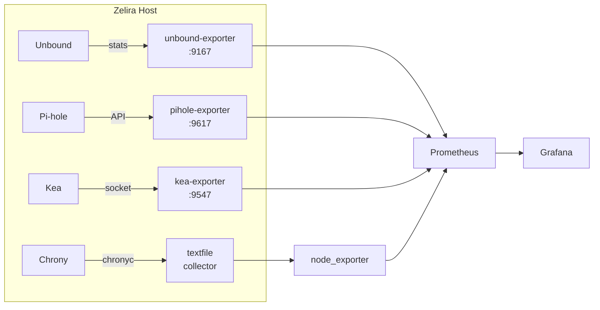

# Add-on: Observability & Metrics Framework

> **Status:** Framework documented. Individual exporters are future work.

This document defines the standard metrics interface for Zelira services. It's designed for Prometheus + Grafana but uses textfile collectors, so no additional daemons are required.

## Architecture



## Available Metrics

| Service | Exporter | Port | Key Metrics |
|---------|----------|------|-------------|
| **Unbound** | `ar51an/unbound-exporter` | 9167 | `unbound_total_num_queries`, `unbound_total_num_cachehits`, `unbound_num_recursivereplies` |
| **Pi-hole** | `eko/pihole-exporter` | 9617 | `pihole_domains_being_blocked`, `pihole_dns_queries_today`, `pihole_ads_blocked_today` |
| **Kea** | `mweinelt/kea-exporter` | 9547 | `kea_dhcp4_addresses_total`, `kea_dhcp4_addresses_assigned`, `kea_dhcp4_packets_received` |
| **Chrony** | textfile via `chronyc` | — | `chrony_stratum`, `chrony_system_time_seconds`, `chrony_rms_offset_seconds` |

## Chrony Textfile Collector

The simplest exporter — runs via cron, writes to a textfile that `node_exporter` reads:

```bash
sudo tee /usr/local/bin/chrony-metrics.sh > /dev/null << 'SCRIPT'
#!/bin/bash
OUTPUT="/var/lib/node_exporter/textfile/chrony.prom"
mkdir -p "$(dirname "$OUTPUT")"
tracking=$(chronyc -c tracking)
cat > "$OUTPUT" << EOF
# HELP chrony_stratum NTP stratum
chrony_stratum $(echo "$tracking" | cut -d, -f3)
# HELP chrony_system_time_seconds System time offset from NTP
chrony_system_time_seconds $(echo "$tracking" | cut -d, -f5)
# HELP chrony_last_offset_seconds Last clock update offset
chrony_last_offset_seconds $(echo "$tracking" | cut -d, -f7)
# HELP chrony_rms_offset_seconds RMS offset
chrony_rms_offset_seconds $(echo "$tracking" | cut -d, -f8)
EOF
SCRIPT
chmod +x /usr/local/bin/chrony-metrics.sh
echo "* * * * * root /usr/local/bin/chrony-metrics.sh" | sudo tee /etc/cron.d/chrony-metrics
```

## Container Exporters

When ready, these can be deployed as additional Podman containers:

```bash
# Unbound exporter
podman run -d --name unbound-exporter --network host \
  docker.io/ar51an/unbound-exporter:latest \
  -unbound.host="tcp://127.0.0.1:8953"

# Pi-hole exporter
podman run -d --name pihole-exporter --network host \
  -e PIHOLE_HOSTNAME=127.0.0.1 \
  -e PIHOLE_API_TOKEN=your-api-token \
  docker.io/ekofr/pihole-exporter:latest

# Kea exporter
podman run -d --name kea-exporter --network host \
  -v /srv/kea/sockets:/kea/sockets:ro \
  docker.io/mweinelt/kea-exporter:latest \
  --kea-socket /kea/sockets/kea.socket
```

## Grafana Dashboard IDs

Community dashboards to import:

| Service | Dashboard ID | Notes |
|---------|-------------|-------|
| Pi-hole | `10176` | Official Pi-hole exporter dashboard |
| Unbound | `11705` | Unbound resolver metrics |

## Future Work

- [ ] `deploy-metrics.sh` script following the same pattern as other add-ons
- [ ] Bundled Grafana dashboard JSON
- [ ] Alert rules for Prometheus (DNSSEC failure, NTP drift >1s, DHCP pool exhaustion)
