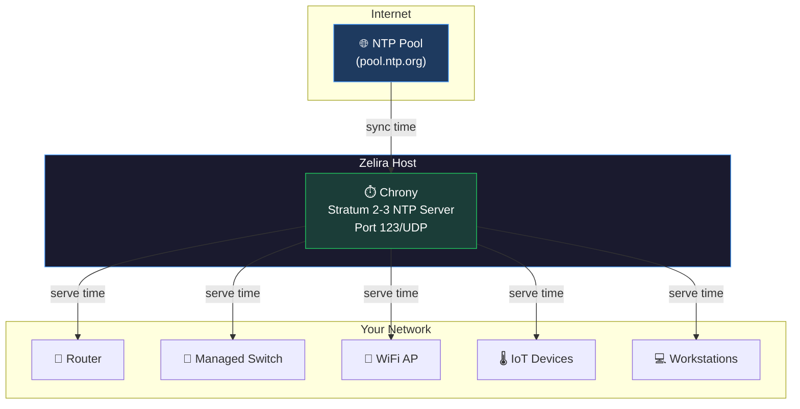

# Add-on: NTP Time Server (Chrony)

Run a proper NTP server on your Zelira host so every device on your network gets accurate time from a local source instead of reaching out to the internet.

## Why This Matters

Accurate time is critical for:
- **DNSSEC validation** — Unbound checks certificate timestamps. Wrong time = DNSSEC failures = DNS goes down.
- **DHCP lease management** — Kea uses timestamps for lease expiry. Wrong time = phantom leases or premature expiry.
- **Log correlation** — if your devices disagree on what time it is, your logs are useless for debugging.
- **TLS certificates** — HTTPS fails if the client or server clock is off by more than a few minutes.

By running Chrony on the same box as your DNS/DHCP stack, you get a local stratum 2/3 NTP server that all your devices can use — routers, APs, switches, IoT devices, everything.

## How It Works



## Setup

### 1. Install Chrony

```bash
sudo apt install chrony
```

### 2. Configure

```bash
sudo tee /etc/chrony/chrony.conf > /dev/null << 'EOF'
# ─── Upstream Sources ──────────────────────────────────
# Use the Debian pool as primary upstream
pool 2.debian.pool.ntp.org iburst

# If you have a local GPS NTP server, add it here:
# server 192.168.1.100 iburst prefer

# ─── Client Access ────────────────────────────────────
# Allow your LAN to query this NTP server
# Adjust the subnet to match your network
allow 192.168.1.0/24
# allow 10.0.0.0/8
# allow 172.16.0.0/12

# ─── Clock Discipline ─────────────────────────────────
# Step the clock if off by more than 1 second (first 3 updates only)
makestep 1 3

# Sync the RTC (hardware clock) periodically
rtcsync

# Drift file — Chrony learns your clock's drift rate
driftfile /var/lib/chrony/chrony.drift

# Log directory
logdir /var/log/chrony

# Max allowed frequency uncertainty for updates
maxupdateskew 100.0
EOF
```

### 3. Enable and Start

```bash
sudo systemctl enable --now chrony
```

### 4. Verify

```bash
# Check sources
chronyc sources

# Check tracking accuracy
chronyc tracking

# Expected output:
# Reference ID    : ... (pool server)
# Stratum         : 3
# System time     : 0.000017 seconds slow of NTP time
# Last offset     : -0.000117 seconds
```

## Point Your Devices at It

### Via DHCP (Kea)

Add NTP option to your Kea config (`/srv/kea/etc-kea/kea-dhcp4.conf`):

```json
{
  "name": "ntp-servers",
  "code": 42,
  "data": "192.168.1.2"
}
```

Add this to the `option-data` array alongside your existing DNS and router options. Restart Kea:
```bash
sudo systemctl restart container-kea-dhcp4
```

### Via Router

Most routers have a "NTP Server" field in the DHCP settings. Set it to your Zelira host's IP.

### On Managed Switches

Most managed switches (MikroTik, EnGenius, etc.) have an SNTP/NTP setting in their system config. Point it at your Zelira host.

## Monitoring

```bash
# How many clients are querying this NTP server
chronyc clients

# Current system accuracy
chronyc tracking | grep "System time"
```

## Optional: Prometheus Metrics

Export Chrony metrics for Grafana dashboards:

```bash
# Create a metrics exporter script
sudo tee /usr/local/bin/chrony-prom.sh > /dev/null << 'SCRIPT'
#!/bin/bash
OUTPUT="/var/lib/node_exporter/textfile/chrony.prom"
mkdir -p "$(dirname "$OUTPUT")"

tracking=$(chronyc -c tracking)
stratum=$(echo "$tracking" | cut -d, -f3)
system_time=$(echo "$tracking" | cut -d, -f5)
last_offset=$(echo "$tracking" | cut -d, -f7)
rms_offset=$(echo "$tracking" | cut -d, -f8)
freq_ppm=$(echo "$tracking" | cut -d, -f9)

cat > "$OUTPUT" << EOF
# HELP chrony_stratum NTP stratum of this server
chrony_stratum $stratum
# HELP chrony_system_time_seconds Offset of system time from NTP
chrony_system_time_seconds $system_time
# HELP chrony_last_offset_seconds Last clock update offset
chrony_last_offset_seconds $last_offset
# HELP chrony_rms_offset_seconds RMS offset
chrony_rms_offset_seconds $rms_offset
# HELP chrony_frequency_ppm Frequency offset in ppm
chrony_frequency_ppm $freq_ppm
EOF
SCRIPT
chmod +x /usr/local/bin/chrony-prom.sh

# Run every minute via cron
echo "* * * * * root /usr/local/bin/chrony-prom.sh" | sudo tee /etc/cron.d/chrony-prom
```

Then configure `node_exporter` with `--collector.textfile.directory=/var/lib/node_exporter/textfile/`.
